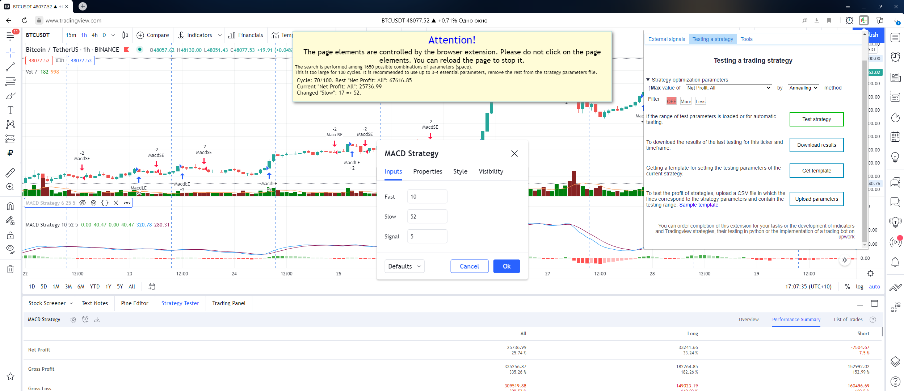
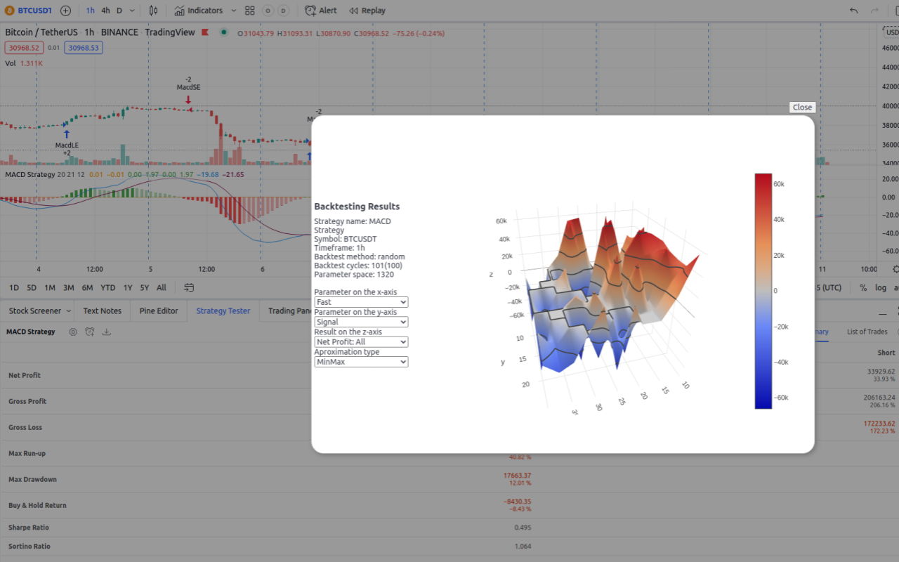
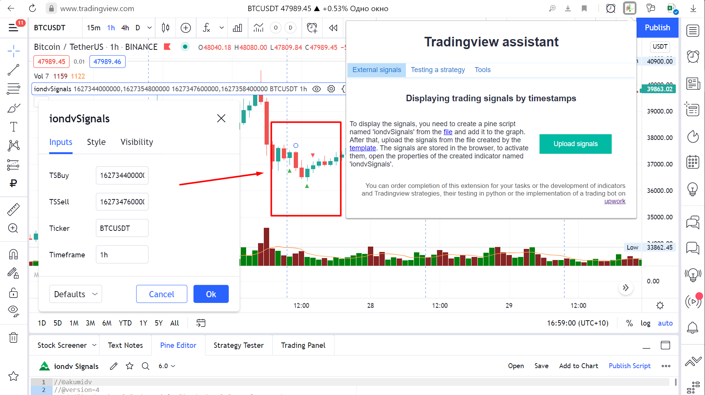

# About
An assistant for backtesting trading strategies and checking (showing) external signals in Tradingview implemented as a Chrome browser extension.

Add to Chrome from [webstore](https://chrome.google.com/webstore/detail/tradingview-assistant/pfbdfjaonemppanfnlmliafffahlohfg)

[Watch the youtube video](https://youtu.be/xhnlSCIlEkw)


## Functionality


### Backtesting trading strategies, optimisation of the strategy's parameters:



* automatic getting a list of parameters and their types (numeric, lists and checkboxes are supported)
* generation of the testing range according to the rule: the beginning value is 2 times less than the current one, the end is 2 times more than the current one.
* saving the generated parameters of testing a trading strategy for their correction as a template in a file in CSV format
* Loading adjusted parameter ranges from a CSV file
* Configuring the optimisation model:
    * Choosing the type of optimisation: searching for the maximum or minimum values
    * Selecting an optimised value from the entire list of strategy results in Tradingview (Net Profit, Ratio Avg Win / Avg Loss, Sharpe Ratio, Sortino Ratio, etc.)
    * Choosing a search strategy in the parameter space(random, sequential, annealing method)
* Filtering of unsuitable results. For example, the number of tradings is less than necessary
* Setting the number of cycles to search for parameters.
* Performing automatic selection of parameters with storing all the results in the browser storage and the ability to save them as CSV files after testing, including in case of an error or page reloading
* Showing backtesting results on 3d chartto analyze the effect of various parameters on the result.


#### Optimization Methods


### Upload external signals to tradingview chart

Loading external buy or sell signals by timestamps from a CSV file*



To display the signals, you need to create a pine script named 'iondvSignals' from the script bellow add it to the chart:
```
//©akumidv
//@version=4
study("iondv Signals", shorttitle="iondvSignals", overlay=true)
strTSBuy = input("", "TSBuy")
strTSBuy = input("", "TSSell")
tickerName = input("", "Ticker")
var arrTSBuy = str.split(buy_series_time, ",")
var arrTSSell = str.split(sell_series_time, ",")
plotchar(tickerName == syminfo.ticker and array.includes(arrTSBuy, tostring(time)) ? low : na, location = location.belowbar, color=color.green, char='▲')
plotchar(tickerName == syminfo.ticker and array.includes(arrTSSell, tostring(time)) ? low : na, location = location.abovebar, color=color.red, char='▼')
```

After that, upload the signals from the file created accordingly the template
```CSV
timestamp,ticker,timeframe,signal
1625718600000,BTCUSDT,1m,BUY
2021-07-27T01:00:00Z,BABA,1H,SELL
```

The signals are stored in the browser, to activate them, open the properties of the created indicator named 'iondvSignals'.

## Setup

Install from (Chrome webstroe)[https://chrome.google.com/webstore/detail/tradingview-assistant/pfbdfjaonemppanfnlmliafffahlohfg]

Or manually add the latest version to chrome based browser from this repository by following the instruction below.

Click on the browser's address bar, insert `chrome://extensions` and follow this link. Click on the "Developer mode" switch.

The "Load unpacked" button should appear. Click on it, and in the window that opens, select the folder with the saved
repository files (you can download them as a zip archive via the
link https://github.com/akumidv/tradingview-assistant-chrome-extension/archive/refs/heads/main.zip).

The `manifest.json` file is located in the root folder of the extension.

### Update
Unpack the new version to the same directory as the previous version (it is better to delete the files of the previous version).
Go to the extensions tab by following the link `chrome://extensions`. Click the restart button for the extension.

## PS
** The field separator for CSV files is a comma.
